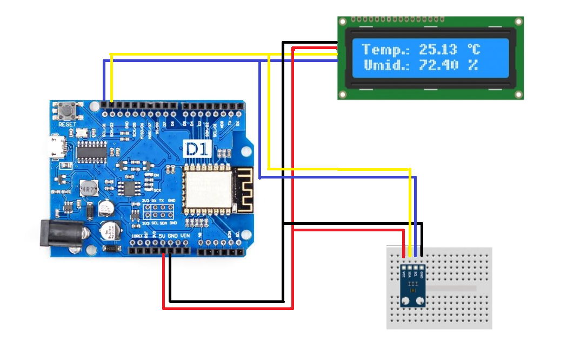
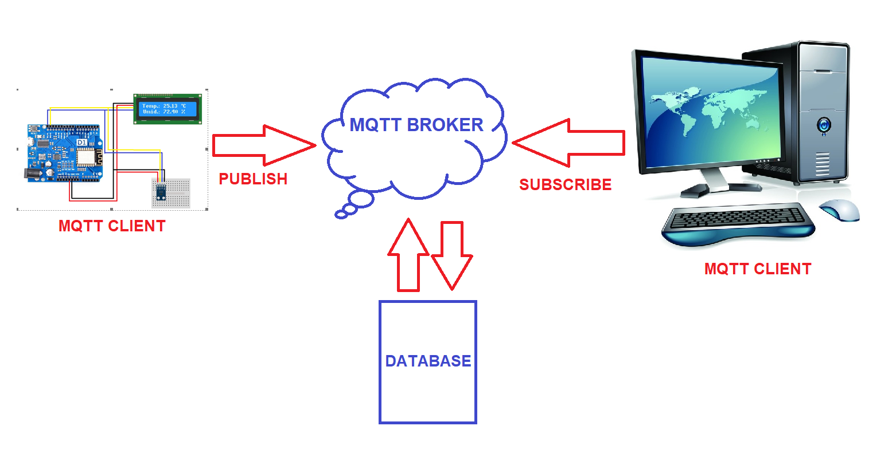

# Sobre o Projeto
O projeto é baseado em um circuito onde são utilizados componentes como uma placa Wemos D1, um sensor de temperatura e um Display LCD, no qual ao captar temperatura, apresenta o valor medido no Display, e também envia os dados para a Internet utilizando o protocolo MQTT. 
Os sensores de temperatura e umidade são dispostivos capazes de mensurar a umidade relativa do ar e a temperatura de um ambiente, produto ou equipamento. 
Eles podem ser utilizados tanto ao ar livre como também em ambientes fechados. 
Trata-se de um instrumento muito utilizado em farmácias, laboratórios, almoxarifados e hemocentros, entre outros ambientes. 
O equipamento pode ser portátil e possui um tempo de resposta bastante baixo: em apenas alguns segundos, já é capaz de indicar a temperatura relativa do ar. 
O sensor também contribui para que instituições possam manter as suas operações dentro das normas vigentes caso for preciso.

# Componentes

Os componentes utilizados nesse projeto foram:

* Placa Wemos D1

* Sensor de Temperartura e Umidade de Alta Precisão HDC1080

* Display LCD 

# Aplicações utilizadas

Utilizamos para desenvolver o projeto e estabelecer o protocolo MQTT no projeto

* Arduino IDE
Pode ser baixada em https://www.arduino.cc/en/main/software
* API Thingspeak
Link do Canal do projeto : https://thingspeak.com/channels/1087000

# Circuito e Montagem

Conforme circuito abaixo, podemos verificar que ligamos no mesmo barramento da protoboard os pinos SDA,SCL, 5VV e GND tanto do display como no sensor

# Circuito e Montagem

# O protocolo MQTT
O protocolo MQTT, ou Message Queuing Telemetry Transport (MQTT) é um protocolo de mensagens destinado a sensores e outros dispositivos. Seu principal uso é fazer as máquinas trocarem informações entre elas, modalidade de comunicação conhecida como Machine-to-Machine (M2M, traduzindo para o português, de máquina para máquina). Essa tecnologia foi desenvolvida pela IBM no final dos anos 90, e sua finalidade original era conectar sensores de satélites ou pipelines de petróleo. Apesar de ter criado há um tempo, sua aplicabilidade ainda é excepcionalmente útil na atualidade, inclusive em diversos ramos empresariais.
A comunicação entre aparelhos é assíncrona, isso significa que os dados podem ser transmitidos com intervalos em um fluxo estável. Isso ocorre porque ele utiliza um paradigma de publishers (publicadores) e subscribers (assinantes) baseado em TCP/IP, cliente e broker.

Seu funcionamento não é tão complicado quanto parece: o publicador envia a mensagem ao broker, que enfileira e dispara as informações recebidas aos assinantes (que podem ser múltiplos aparelhos). Esses últimos recebem as mensagens que possuem interesse. O TCP/IP citado é uma forma de identificação entre os dispositivos.
No nosso projeto, estamos adotando o paradigma publisher, isso, porque coletamos de dados para que os mesmos possam ser enviados para um broker publico. O brokler que utilizamos é a API Thingspeak, onde com ela, conseguimos demonstrar as medições de forma gráfica em um determinado período de tempo. Abaixo, temos um esquema funcional de como funciona o protocolo MQTT em nosso projeto. 

O MQTT possui dois componentes: Agente MQTT, que seria é um ponto central de comunicação, nesse caso, chamamos de broker, no qual é responsavel  por despachar todas as mensagens entre os clients, e os Clientes MQTT, que são os dispositivos que se conectam ao broker, no nosso caso, o módulo ESP8266 faz essa comunicação ao enviar os dados para o API utilizada nesse projeto.

# Código

## Considerações iniciais
Para o desenvolvimento do projeto, tilizamos a biblioteca Wire para a comunicação I2C com a Wemos D1,a biblioteca ClosedCube_HDC1080, para aferir junto com o sensor, os dados de
temperatura e umidade ambiente, a biblioteca LiquidCrystal_I2C para a utilização do Display LCD, e claro, a biblioteca ESP8266WiFi para poder estabelecer uma conexão com a rede.

## Setup
No Setup, inicializamos o Display LCD, assim como o Sensor, abrimos a conexão Wifi, e setamos uma formatação de dados para o Display, conforme apresentado na figura

## Loop

Na parte do Loop, incluimos o que queremos que a aplicação em si faça. Nesse caso,começamos aferindo a temperature e a umidade ambiente junto com o sensor. Após isso, fazemos uma validação para verificar se a leitura ocorre de forma correta, caso, não ocorra, será apresentada uma mensagem no Monitor Serial da aplicação, ou se a leitura for feita com sucesso, conectamos com a API pela porta 80, concatenamos os dados medidos em uma String, e esses dados serão enviados a cada medição feita para os campos determinados na nossa API (No caso, utilizamos dois campos, um para temperatura e outro para a umidade).

# Resultados
A montagem do circuito foi feita com sucesso conforme pode ser visto na figura. A precisão do sensor é tão precisa que em ambientes internos a temperatura por muitas vezes é maior, pelo fato dos ambientes serem mais quentes devido ao abafamento. Porém, quando testamos em um ambiente externo, a temperatura e a umidade relativa do ar foram medidas com sucesso.Em relação ao display, a sua instalação dentro do circuito também não foi dificil, visto que já tinhamos o o controlador HD44780 já soldado 

Referente a implantação do MQTT, a mesma foi realizada com sucesso devido a facilidade com a comunicação com a a API que possui uma boa base de documentação explicativa sobre MQTT, no qual facilitou no entendimento e conforme citado anteriormente, na construção do projeto. Outro ponto importante, é a disponibilidade de gráficos e estilização na qual podemos aplicar, isso é importante depenendo de como queremos visualizar os dados. Conforme verificdo na figura, temos as últimas medidas aferidas representadas no gráfico, como temos a informação da temperatura atual. 

 
 
 Aqui está um link do vídeo de apresentação do projeto:
https://www.youtube.com/watch?v=uMxsGWlJOgg

 

